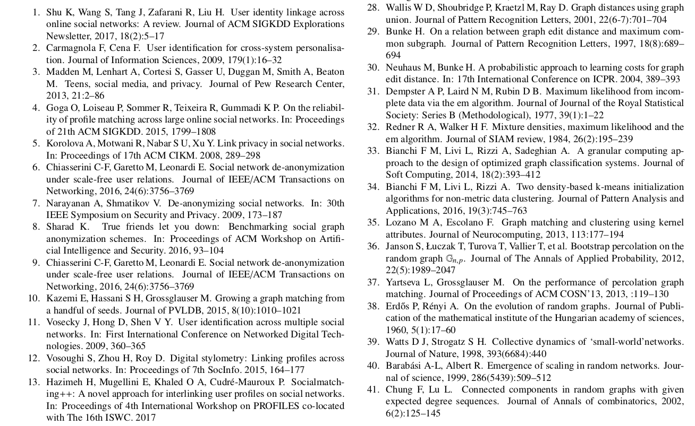

My modification of **model6-num-names.bst**  file to support style reference for the  [Frontiers of Computer Science](https://www.springer.com/journal/11704) articles.

To enable:
```latex
% --- Biblio style ---
\bibliographystyle{model6-num-names-modified}
% --- enumerate bybliography ---
\makeatletter \renewcommand\@biblabel[1]{#1.} \makeatother
```

#### Examples
a) All refenrences should be changed into standardized form instead of italic. Names of all authors should be listed as “ last name，Capitalization of the first letter of First name”, and do not use "and" between two authors.

b) Conference papers cited should be written as follows

*Zhang W L, Gao K H, Zhang Y, Li J. Efficient approximate nearest neighbor search with integrated binary codes. In: Proceedings of ACM International Conference on Multimedia. 2011, 1189-1192*


c) Journal papers cited should be written in such a way as :

*Chu W S, Li C M, Tseng S. Travelmedia: an intelligent management system for media captured in travel. Journal of Visual Communication and Image Representation, 2011, 22(1):93–101*

d) Books cited should be written in such a way as :

*Gardon A G, Wolfhard H G. Flames. 2nd ed. London: Chapman and Hall Led, 1960*

#### Other examples
